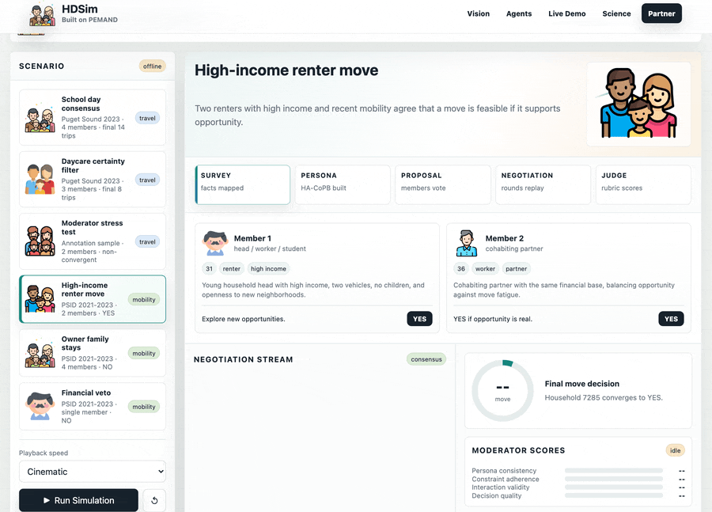
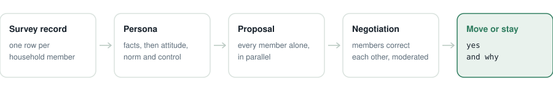

# 🏡 residential-mobility

Household **move-or-stay relocation decisions** simulated via persona-enriched multi-agent negotiation (**PEMAND**).

<p>
<a href="https://github.com/HDSim-AI/residential-mobility"></a>
<a href="https://github.com/HDSim-AI/residential-mobility/actions/workflows/ci.yml"></a>
<a href="https://github.com/HDSim-AI/residential-mobility/blob/main/pyproject.toml"></a>
<a href="./LICENSE"></a>
<a href="https://arxiv.org/abs/2604.10475"></a>
<a href="https://yushundong.github.io/pemand_simulation/pemand_official_site.html"></a>
</p>

<!-- Uncomment both once the package is published to PyPI:
<a href="https://pypi.org/project/hdsim-mobility/"></a>
<a href="https://pepy.tech/project/hdsim-mobility"></a>
-->

**A domain package.** The method lives in [`hdsim`](https://github.com/HDSim-AI/hdsim), the core; this repository adds only the panel loader and the configuration for one decision. [`travel-decision`](https://github.com/HDSim-AI/travel-decision) is the other.



## What this does

Predicts whether a household moves. It reads PSID panel records and returns a yes or no for each
family, with the conversation that produced it.

<picture>
  <source media="(prefers-color-scheme: dark)" srcset="./docs/pipeline-mobility-dark.svg">
  
</picture>

Moving is a yes or no rather than a count, so this domain adds a classification decision head and an
affordability check in the moderator. Everything else is the protocol
[`travel-decision`](https://github.com/HDSim-AI/travel-decision) uses.

| You are trying to… | What you get |
|---|---|
| Plan for evacuation or post-disaster relocation | Move or stay, household by household |
| Test a housing or rent policy you cannot field a survey for | A counterfactual run on families already in your data |
| Understand which member drives a household's decision | The transcript, including who objects and why |

On PSID 2021–2023 this raises F1 from 0.55 to 0.73 against the strongest classical baseline.
Table 1, [arXiv:2604.10475](https://arxiv.org/abs/2604.10475).

| You want to… | Go to |
|---|---|
| Run a family through the model | [Quick start](#quick-start) |
| Understand the method itself | [hdsim](https://github.com/HDSim-AI/hdsim) |
| See a move-or-stay case replayed in the browser | [Live demo](https://yushundong.github.io/pemand_simulation/pemand_official_site.html) |
| Predict household trips instead | [travel-decision](https://github.com/HDSim-AI/travel-decision) |

## Quick start

```bash
pip install -e .
hdsim demo                        # offline replay, no API key needed
```

`hdsim demo` plays the recordings bundled with the method core, which are travel negotiations.
Move-or-stay recordings are not bundled yet; to see one now, use the
[live demo](https://yushundong.github.io/pemand_simulation/pemand_official_site.html), which
replays three PSID cases in the browser.

Simulate the bundled family against a model:

```bash
cp ../hdsim/.env.example .env     # add HDSIM_API_KEY
python examples/run_mobility.py
```

```python
from hdsim.mobility import PSID, build_personas, load_example, simulate

family = load_example()
build_personas(family, PSID)
simulate(family, PSID)
print(family.consensus_value)     # True or False
```

Real data: `load_psid("panel.csv")`. PSID requires registration at
<https://psidonline.isr.umich.edu>. No survey data ships with this package.

Requires [`hdsim`](https://github.com/HDSim-AI/hdsim), the method core.

## Contributing

Loaders for another household panel, better fact translations, new scenarios and evaluations all
belong here; see [CONTRIBUTING.md](CONTRIBUTING.md). Changes to the method itself belong in
[`hdsim`](https://github.com/HDSim-AI/hdsim), and adding a whole new decision is
[one file](https://github.com/HDSim-AI/hdsim/blob/main/examples/minimal_domain.py).

## Citation

```bibtex
@article{sun2026pemand,
  title   = {PEMAND: Persona-Enriched Multi-Agent Negotiation for Household Decision-Making},
  author  = {Sun, Yuran and Sameen, Mustafa and Zhang, Yaotian and Gu, Rongguan and
             Vibhute, Mrunal and Wu, Chia-yu and Lei, Yuanyuan and Zhao, Xilei},
  journal = {arXiv preprint arXiv:2604.10475},
  year    = {2026}
}
```

## License

MIT
